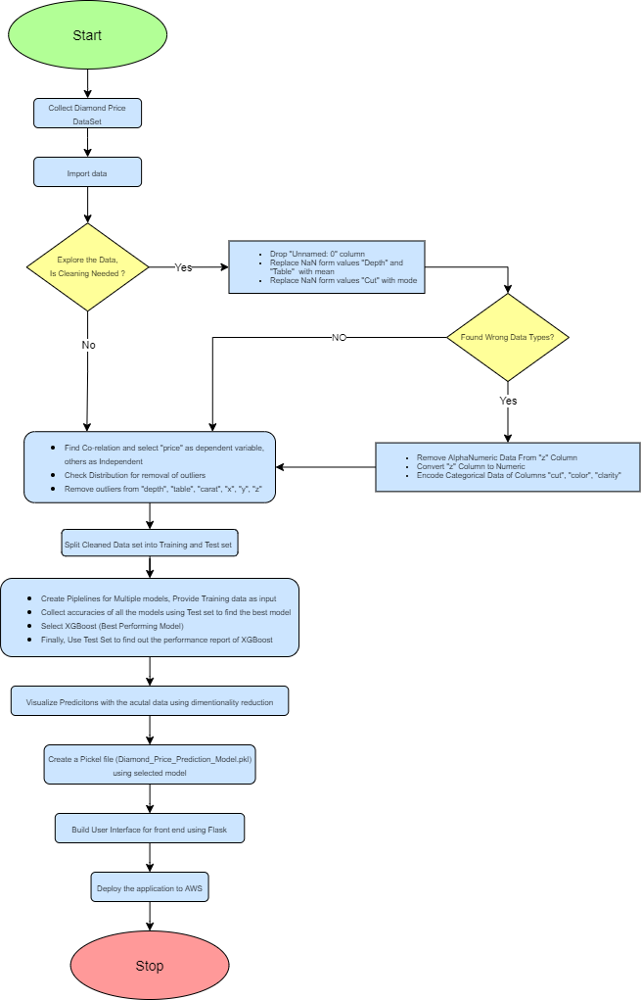

# ML Based Diamond Price Estimator

* __Progress__ :

    * Explored Various topics like : 
        * Vegetable recognition
        * Dating Profile compatibility recomendation
        * new word pediction
        * graduate salary Prediction
    * Finally picked Diamond Price Prediction
    * Sources for Required Dataset that suits our requirements.
    * Finalised Our dataset from Dataset Search by google
    * Understood the significance of columns present in the dataset
    * Dropped __`Unnamed: 0`__ which was a redundant column 
    * __`NaN`__ Values were filled with mode/mean based on the column type
    * Data type for column __`z`__ was object (string) , even though the data was numeric, few strings were removed and column was converted to numeric
    * Encoded columns __`cut`__ , __`clarity`__ , __`color`__ containing object data type to numerical using LabelEncoder 
    * Based on the co-relations, selected __`price`__ as dependent and other columns as independent
    * Removed Impossible Values along with outliers from  __`depth`__, __`table`__, __`clarity`__, __`x`__, __`y`__, __`z`__ columns
    * Explored different regression algorithms
    * Created multiple pipelines for  __`Linear Regression`__, __`Random Forest`__, __`Decsion Tree`__, __`XGBoost`__, __`Polynomial Regression`__, __`K Nearest Neighbour`__
    * Trained above models with Training data set
    * Calculated the accuracies using Test data set and comapred all the models
    * Concluded that __`XGBoost`__ was the best performing one with an accuracy of 98.22%
    * Created a pickel file out of the decided model
    * Using Flask locally hosted a simple working User Interface
    * Created shell script for deployment of our project 
    * Created an AWS EC2 instance
    * Using shell script, uploaded the project
    * URL : https://hluiyovfp4.execute-api.us-west-2.amazonaws.com/

